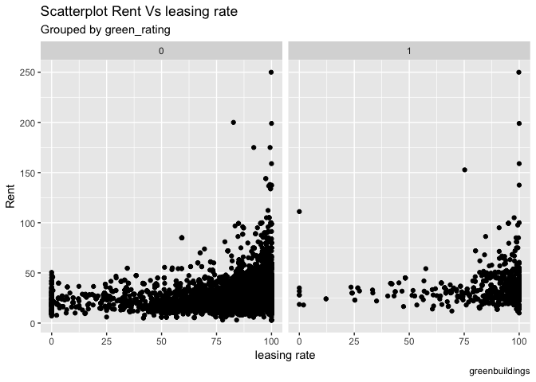
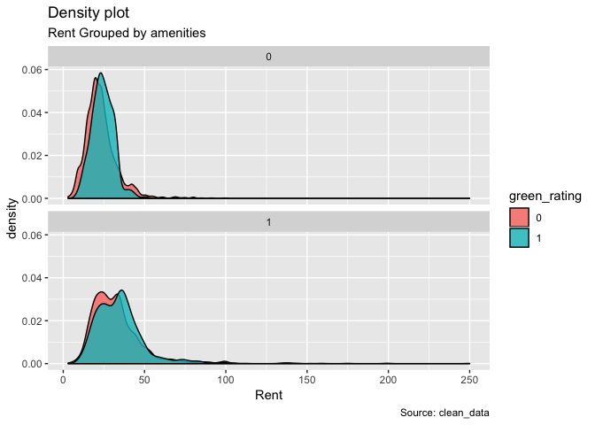
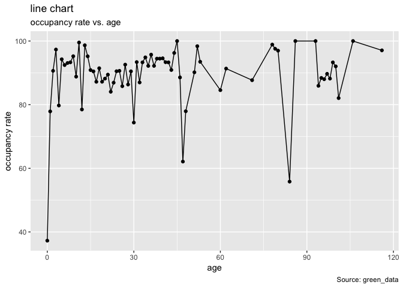
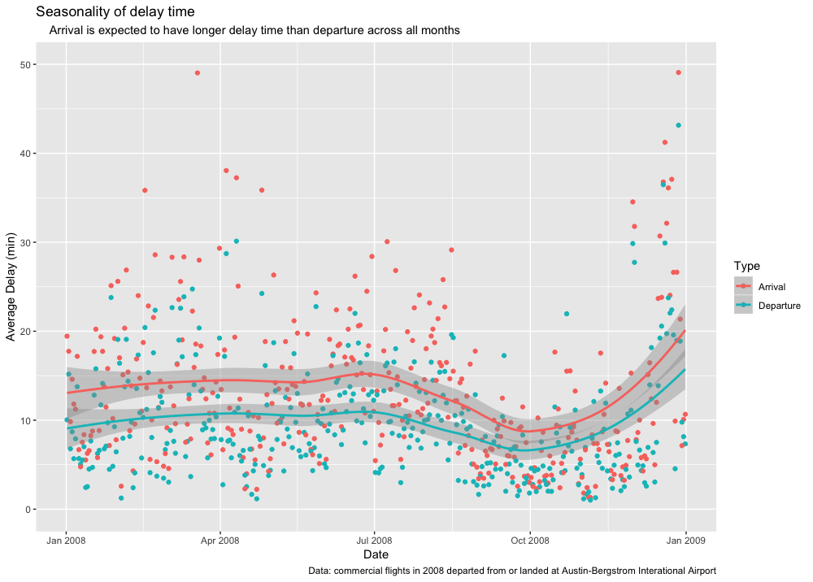
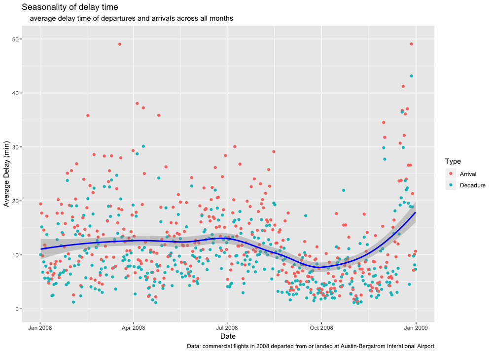
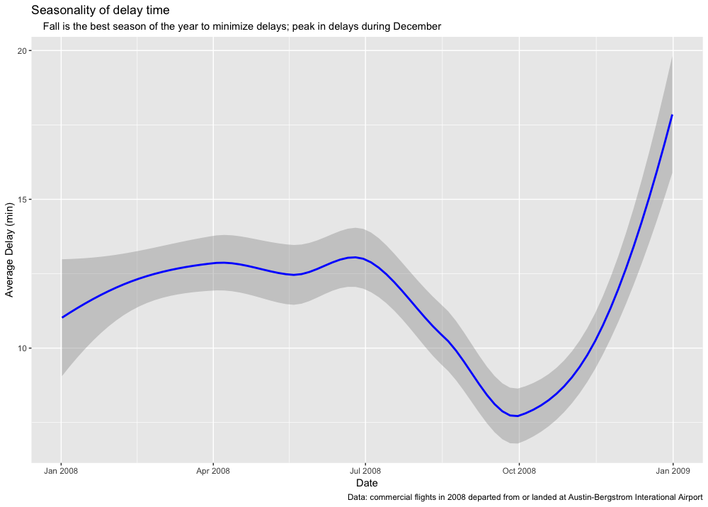
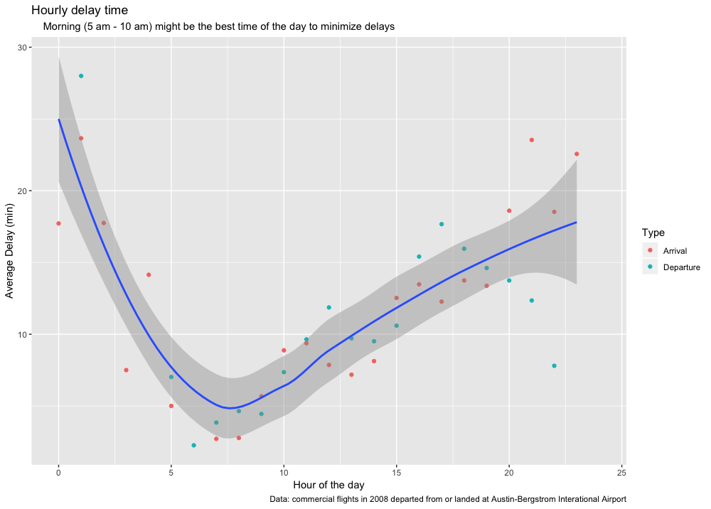
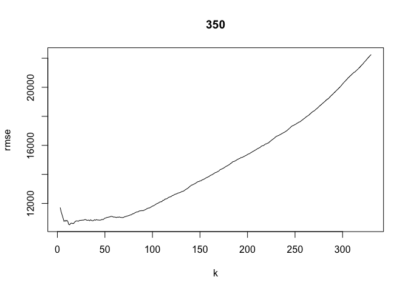
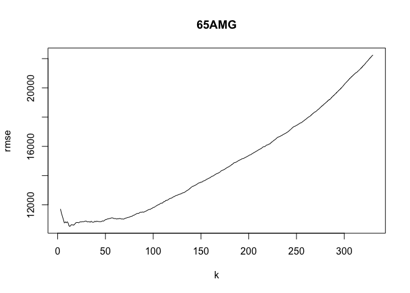
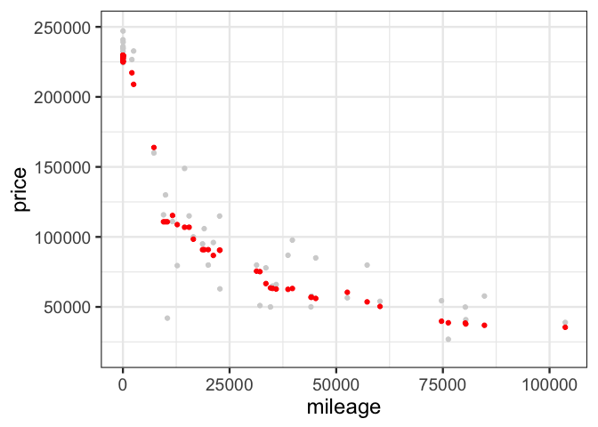

Exercise 1
================
Q1  Data visualization 1: green buildings
----------------


In fact, there are some covariates that the staff didn't take seriously when he gave the suggestion to the "green building plan". The method that just use the median od two parts to calculate the revenue is kind of ridiculous.

We process the data and give some visualization plots as the evidence to support our ideas.

Firstly, we use the density graph to show the distribution of Rent for green buildings and Non-green buildings, from this graph, we can see that the rent distribution of green buildings is a little higher than the non greens.


Secondly, we can not agree with the method that dropping the buildings whose leasing rate is lower than 10% in the data set. Since there may be some other causes that make the buildings have such a low occupancy rate, it is not serious to drop the data directly. In addition, from visualization graph, we can not see the obvious correlation between rent and leasing rate.



Thirdly, we want to find whether there are other covariates to influence the difference of the rent between green buildings and non-green buildings.

In order to show the evidence clearly, we process the data into green part and non-green part.

We check the effect of net, size, amenities and class on rent difference in this part.


The graph shows that rent difference is larger for the buildings have net contract than the buildings without net contract.

 The graph shows that rent difference is larger for the buildings with amenities than the buildings without amenities.


class 0 represent class c, class 0.5 represent class a, and class 1 represent class b, the rent difference is larger in class a than in class b and c.

At last, we want to check whether we can reach at the 80% occupancy rate in first 8 years.



For the green buildings, we can find that we can not use the 80% occupancy rate from first year, we need to consider that our cost back process will be longer since the occupancy rate need some time to acheive at 80% and higher.

In conculsion, the location,the amenities around, the property of the contract???the class of the building will influence the rent of the building, this will impact the revenue we can get from the building. In addition, the leasing rate will affect the time we return the cost, the occupancy rate can not reach high at a eraly age. We think that it is possible to use his logic to make the decision, but we need to consider much more covariates to make the accurate decision.


</br> </br> </br>


Q2  Data visualization 2: flights at ABIA
-------------------------------------

In this question, we explore the best time to fly to and depart from Austin-Bergstrom Interational Airport in order to minimize delay.


</br>

##### data-preprocessing

-   new variable 'type': label the flight type as 'Departure' from or 'Arrival' at Austin.
-   new variable 'delaytime': use the departure delay 'DepDelay' as the delay time for departure flights, and arrival delay 'ArrDelay' for arrivals.
-   modify 'delaytime': normalize the delay time to 0 for early departures and arrivals (delay time being negative), assuming that people only care about delays.


</br>

### Seasonality of delays - best time of the year to travel from & to Austin?


</br>

##### data-processing for seasonality

-   new variable 'date': format the month and date into one variable.
-   calculate the average delay time of departure & arrival flights seperately, across all dates of the year.

##### plotting

-   plot the average delay time for two types of flights across all dates.
-   add the trend line for departure and arrival flights (method: lasso)


</br>




</br> </br>

-   plot the trend line for all flights from and to Austin and zoom in to see the details.


</br>




</br>


</br>




</br>

We see that throughout the year, arrival flights at Austin are expected have longer delays than departure flights from Austin. Overall, fall (from September to November) is the best season of the year to minimize delays whereas December is the worst month of the year.


</br>

### Delays in a day - best hour of the day to travel from & to Austin?


</br>

##### data-processing for delays in a day

-   new variable 'time': use the scheduled departure time 'CRSDepTime' as the time for departure flights, and scheduled arrival time 'CRSArrTime' for arrivals.

-   new variable 'hour': round the time to the nearest hour.
-   calculate the average delay time of departure & arrival flights seperately, across all hours of the day.

``` r
summary(ABIA$time)
```

    ##    Min. 1st Qu.  Median    Mean 3rd Qu.    Max. 
    ##       5    1040    1430    1416    1800    2359


</br>

##### plotting

-   plot the average delay time for two types of flights across all hours.
-   add the trend line for flights departed from and arrived at Austin (method: lasso).


</br>




</br>

We see that average delay time increases from 9:00 to 24:00, and reaches peak at midnight. Morning (5 am - 10 am) might be the best time of the day to minimize delays.

Overall, the best way to minimize delay in Austin-Bergstrom Interational Airport is to depart from Austin in the morning of October!


</br> </br>


Q3  Regression vs KNN
-----------------

Extract two trims(350 and 65 AMG) from all trim levels.

1.Split the data into training and testing set.

``` r
# define training and testing data
D1_train = sclass350[train_1,]
D1_test = sclass350[-train_1,]

D2_train = sclass65AMG[train_2,]
D2_test = sclass65AMG[-train_2,]

D1_test = arrange(D1_test, mileage)
D2_test = arrange(D2_test, mileage)
```

2.Run K-nearest-neighbors, for many different values of K, starting at K=3. For each value of K, fit the model to the training set and make predictions on your test set.

3.Calculate the out-of-sample root mean-squared error (RMSE) for each value of K.

``` r
rmse1.matrix= matrix(NA,nrow = 328, ncol = 2)
for (i in 3:330) {
  knn=knn.reg(train = X1_train, test = X1_test, y= y1_train, k=i)
  ypred_knn = knn$pred
  rmse(y1_test, ypred_knn)
  rmse1.matrix[i-2,2]=rmse(y1_test, ypred_knn)
  rmse1.matrix[i-2,1]=i
}

rmse2.matrix= matrix(NA,nrow = 228, ncol = 2)
for (i in 3:230) {
  knn=knn.reg(train = X2_train, test = X2_test, y= y2_train, k=i)
  ypred_knn = knn$pred
  rmse(y1_test, ypred_knn)
  rmse2.matrix[i-2,2]=rmse(y2_test, ypred_knn)
  rmse2.matrix[i-2,1]=i
} 
```

Make plot of RMSE versus K for trim 350



Make plot of RMSE versus K for trim 65AMG



For the optimal value of K, the plot of fitted model for trim 350 The optimal value of K is below:

    ## [1] 22

The corresponding RMSE is below:

    ## [1] 10403.37

The plot of fitted model for trim 350


For the optimal value of K, the plot of fitted model for trim 65AMG The optimal value of K is below:

    ## [1] 17

The corresponding RMSE is below:

    ## [1] 16761.19

The plot of fitted model for trim 65AMG



Which trim yields a larger optimal value of K? Why do you think this is?
------------------------------------------------------------------------

Trim 350 yeilds larger optimal value of K. Because the sample size for trim 350 is larger than trim 65AMG. Then I guess the larger the sample size is, the larger the optimal K will be.
