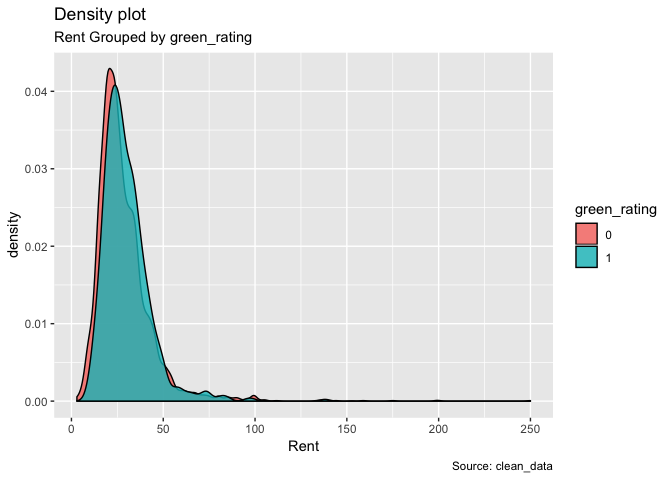
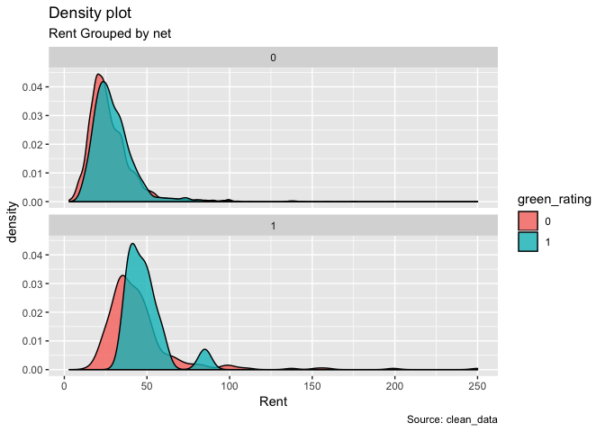
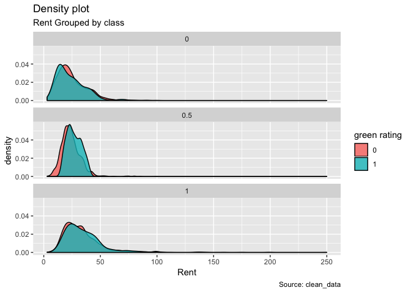

HW1 Q1
================

In fact, there are some covariates that the staff didn't take seriously when he gave the suggestion to the "green building plan". The method that just use the median od two parts to calculate the revenue is kind of ridiculous.

We process the data and give some visualization plots as the evidence to support our ideas.

Firstly, we use the density graph to show the distribution of Rent for green buildings and Non-green buildings, from this graph, we can see that the rent distribution of green buildings is a little higher than the non greens.

Secondly, we can not agree with the method that dropping the buildings whose leasing rate is lower than 10% in the data set. Since there may be some other causes that make the buildings have such a low occupancy rate, it is not serious to drop the data directly. In addition, from visualization graph, we can not see the obvious correlation between rent and leasing rate.

    ## `geom_smooth()` using method = 'gam' and formula 'y ~ s(x, bs = "cs")'

Thirdly, we want to find whether there are other covariates to influence the difference of the rent between green buildings and non-green buildings.

In order to show the evidence clearly, we process the data into green part and non-green part.

We check the effect of net, size, amenities and class on rent difference in this part.

The graph shows that rent difference is larger for the buildings have net contract than the buildings without net contract.

 The graph shows that rent difference is larger for the buildings with amenities than the buildings without amenities.

class 0 represent class c, class 0.5 represent class a, and class 1 represent class b, the rent difference is larger in class a than in class b and c.

At last, we want to check whether we can reach at the 80% occupancy rate in first 8 years.

For the green buildings, we can find that we can not use the 80% occupancy rate from first year, we need to consider that our cost back process will be longer since the occupancy rate need some time to acheive at 80% and higher.

In conculsion, the location,the amenities around, the property of the contract???the class of the building will influence the rent of the building, this will impact the revenue we can get from the building. In addition, the leasing rate will affect the time we return the cost, the occupancy rate can not reach high at a eraly age. We think that it is possible to use his logic to make the decision, but we need to consider much more covariates to make the accurate decision.
